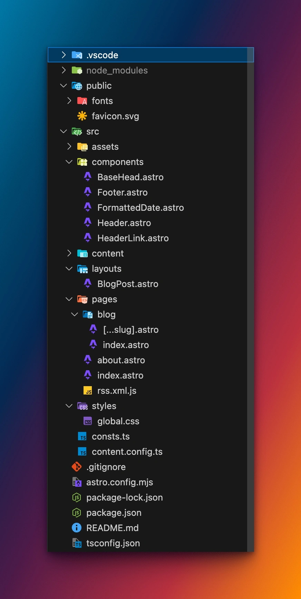

Astro is a modern framework for generating exceptionally fast static websites. I discovered it when I wanted a simple way to create this blog. It can build much more than blogs, but it is particularly well suited to them.

In this article, you will create an Astro blog, customize its appearance and prepare it for deployment.

## Table of contents

- [Prerequisites](#prerequisites)
- [Initialize the project](#initialize-the-project)
- [Create posts](#create-posts)
- [Customize your blog](#customize-your-blog)
- [Conclusion](#conclusion)

## Prerequisites

Install **Node.js 18 or later** and choose a code editor such as VS Code.

## Initialize the project

Run the Astro project wizard:

```bash
npm create astro@latest
```

Choose a directory name, for example `astro-blog`, then select **Use blog template**.

```text
tmpl   How would you like to start your new project?
       ○ A basic, helpful starter project
       ● Use blog template
       ○ Use docs (Starlight) template
       ○ Use minimal (empty) template
```

The basic starter is useful for a showcase site or portfolio. The blog template provides Astro’s official blog structure. Starlight is designed for documentation, and the empty template is ideal when you want to configure everything yourself.

Install the dependencies and start the development server:

```bash
npm install
npm run dev
```

Your site is now available at `http://localhost:4321`.

## Create posts

Astro content can be written in `.md` or `.mdx` files inside `src/content/blog/`. MDX combines Markdown with JSX components. You can also create regular pages inside `src/pages/`.

```mdx
---
title: 'First post'
description: 'Lorem ipsum dolor sit amet'
pubDate: 'Jul 08 2022'
heroImage: '../../assets/blog-placeholder-3.jpg'
---

Welcome to my first Astro post!
```

The frontmatter between the `---` markers contains the post metadata. The rest of the file is its content.

## Customize your blog

Because your blog is code, customization is virtually unlimited:

- Use React, Svelte, Vue or other components directly in `.mdx` files.
- Change the global layout in `src/layouts/` and reusable elements in `src/components/`.
- Edit global styles in `src/styles/` or add a CSS framework such as Tailwind CSS.
- Add search, tags, pagination and other features.
- Install integrations for features such as internationalization.



## Conclusion

Your Astro blog is ready. The next step is to deploy it automatically with GitHub Actions; see [Astro and GitHub Actions: simplified CI/CD](/en/blog/astro-cicd-github/).

Useful resources:

- [Official Astro documentation](https://docs.astro.build)
- [Deploy Astro to GitHub Pages](https://docs.astro.build/en/guides/deploy/github/)
